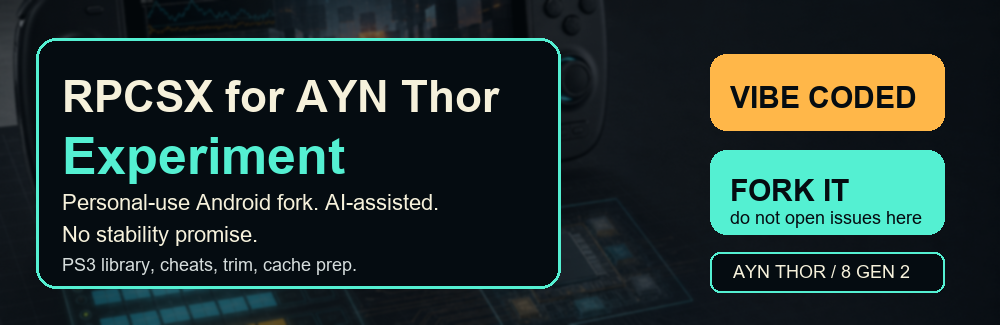

# RPCSX for AYN Thor Experiment

<p align="center">
  
</p>

<p align="center">
  <a href="https://github.com/noeldvictor/rpcsx-ui-android-thor/fork">
    
  </a>
</p>

This is a personal-use Android fork of RPCSX-UI-Android aimed at the AYN Thor Base, Pro, and Max. Those Snapdragon 8 Gen 2 / Adreno 740 models are the main target. It is an experiment, it is vibe-coded with AI assistance, and it will move fast in whatever direction makes this handheld easier to use.

No stability guarantee. No support guarantee. Do not open issues expecting upstream-style triage. If the experiment annoys you, fork it and make your own version.

## Vibe-Coded With AI

This fork is openly AI-assisted and vibe-coded. That means rough edges, fast experiments, blunt tradeoffs, and code that may change because it makes the AYN Thor experience better for personal use. If that bothers you, this is not the repo to depend on.

## Fork Path

This repo is source-first. Fork it, build it, and change what you need for your own AYN Thor.

Build artifacts may exist in GitHub Actions, but this README intentionally does not present a big public download button. No store release, no support queue, no stability promise.

## Thor Variants

This fork treats **AYN Thor Base, Pro, and Max** as one CPU/GPU target. They share the Snapdragon 8 Gen 2 and Adreno 740 performance ceiling; the practical differences are RAM and internal storage.

| Variant | CPU/GPU target | RAM | Internal storage | Fork posture |
| --- | --- | ---: | ---: | --- |
| Thor Base | Snapdragon 8 Gen 2 / Adreno 740 | 8 GB LPDDR5X | 128 GB UFS 4.0 | Same emulation speed target, tighter cache/storage budget. |
| Thor Pro | Snapdragon 8 Gen 2 / Adreno 740 | 12 GB LPDDR5X | 256 GB UFS 4.0 | Default comfort target. |
| Thor Max | Snapdragon 8 Gen 2 / Adreno 740 | 16 GB LPDDR5X | 1 TB UFS 4.0 | Best cache headroom; not a different CPU/GPU speed class. |

Thor Lite is a Snapdragon 865 / Adreno 650 device. It may run the app, but it is not the performance target for PS3 work in this fork.

## What This Fork Is

- A Thor-first Android UI experiment for RPCSX.
- Built around simple library use, external storage game discovery, covers, cheat visibility, and trimming experiments.
- Tuned around the real connected target device: `AYN Thor`, board/platform `kalama`, Android package `net.rpcsx.easy`.
- Still GPLv2, still based on the upstream Android UI, and still dependent on the RPCSX core behavior underneath it.

## What This Fork Is Not

- Not an official RPCSX project.
- Not an AYN project.
- Not a promise that every PS3 game will boot, run fast, or survive every update.
- Not a place to ask for games, firmware, system files, keys, or piracy help.

Use legally owned dumps and legally obtained firmware. Personal use only.

## Screenshots

Captured from the connected AYN Thor test device.


## Where This Diverges

- Rebranded as `RPCSX for AYN Thor Experiment`.
- Automatic upstream UI/core update prompts are disabled for this fork through `BuildConfig.FORK_BUILD=true`.
- External ISO folder import is handled as direct library entries instead of blindly extracting loose ISO contents.
- ISO metadata and cover lookup read `PS3_GAME/PARAM.SFO` and `PS3_GAME/ICON0.PNG` directly where possible.
- Cheat work is now a first-class fork feature: bundled cheat database assets, cheat badges, per-game cheat visibility, Artemis/Aldos import experiments, and RPCS3 patch imports.
- Recommended per-game settings are now a fork feature: the APK bundles an RPCS3 config database snapshot, keeps a writable local cache, and exposes one simple switch per game.
- Trim/Optimize is intentionally visible as an experimental tool path rather than hidden developer plumbing.
- Thor-specific performance research lives under `report/`, including PPU compile/cache notes and Snapdragon 8 Gen 2 targeting.
- Thor compile relief is now applied on AYN/Thor/kalama targets: LLVM compile workers are capped, the suspicious CPU target is cleared back to generic, SPU cache/precompile are kept on, and the process is pinned to Thor performance cores where Android allows it.
- Generated icon and README art are custom for this fork and intentionally avoid console/game/IP logos.
- Android-side performance cleanup has started: less main-thread file probing, faster folder scan queues, safer large-file copy, cached patch status reads, and debounced library saves.

## AYN Thor Target Notes

The connected Thor reports `kalama` hardware and this CPU layout from `/proc/cpuinfo`:

| CPU | Part | Interpreted core |
| ---: | --- | --- |
| 0 | `0xd46` | Cortex-A510 |
| 1 | `0xd46` | Cortex-A510 |
| 2 | `0xd46` | Cortex-A510 |
| 3 | `0xd4d` | Cortex-A715 |
| 4 | `0xd4d` | Cortex-A715 |
| 5 | `0xd47` | Cortex-A710 |
| 6 | `0xd47` | Cortex-A710 |
| 7 | `0xd4e` | Cortex-X3 |

Useful masks for future native/core work:

| Group | CPUs | Mask |
| --- | --- | --- |
| Efficiency only | `0-2` | `0x07` |
| A715 only | `3-4` | `0x18` |
| A710 only | `5-6` | `0x60` |
| Prime X3 only | `7` | `0x80` |
| Performance plus prime | `3-7` | `0xF8` |
| A715 plus prime | `3-4,7` | `0x98` |

The practical performance direction is boring but important: keep PPU/SPU/shader caches on internal storage, cap LLVM compile workers before they heat-soak the handheld, detect actual CPU topology, and expose one obvious Thor preset instead of making people decode advanced settings.

Base/Pro/Max should use the same CPU and GPU presets. Pro/Max mostly let us keep more internal cache, larger game libraries, and more cheat/database state without memory or storage pressure.

## Reports

- [APS3E, RPCSX, and Thor PPU compile notes](report/2026-05-10-aps3e-rpcsx-thor-ppu-compile.md)
- [RPCS3 automatic game settings notes](report/2026-05-10-rpcs3-auto-game-settings.md)
- [AYN Thor Base/Pro/Max Snapdragon 8 Gen 2 target notes](report/2026-05-10-snapdragon-8-gen-2-thor-target.md)
- [Markdown and Thor variant audit](report/2026-05-10-markdown-and-thor-variant-audit.md)

## Building

Requirements:

- Android 10+
- JDK 17
- Android SDK

Debug APK output:

```powershell
.\gradlew.bat :app:assembleDebug
```

Expected debug APK name:

```text
app\build\outputs\apk\debug\rpcsx-thor-experiment-debug.apk
```

## License

This fork keeps the upstream GPLv2 license unless a directory or file contains its own license.
