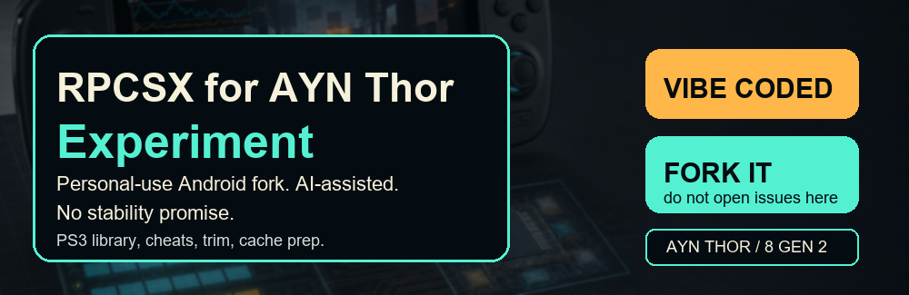

<p align="center">
  
</p>

# RPCSX for AYN Thor

PlayStation 3 emulation on the AYN Thor handheld. This is a personal fork of
RPCSX-UI-Android, tuned specifically for Thor's Snapdragon 8 Gen 2 hardware.

> ### ⚠️ Read this before anything else
>
> **This is a research build, not a product.** It is frequently broken. There is
> no APK download, no support queue, and no stability guarantee. Things that
> worked last week may not work today.
>
> If you want to play PS3 games on a handheld with minimal hassle, this is not
> the right project for you yet.

---

## Is this for you?

**Probably yes, if:**
- You own an AYN Thor and enjoy tinkering
- You are comfortable building an Android app from source
- You want to follow or contribute to PS3-on-ARM performance work
- You accept that some games crash, and some don't boot at all

**Probably no, if:**
- You want a download-and-play experience
- You need reliability
- You don't own an AYN Thor (other devices are untested and unsupported)

---

## What you need

| | |
| --- | --- |
| **Device** | AYN Thor Base, Pro, or Max. Thor Lite may run it but isn't the performance target. |
| **Android** | 10 or newer |
| **Games** | Your own legally-made dumps of discs you own |
| **Firmware** | PS3 firmware obtained legally from Sony |
| **To build** | Android SDK, JDK 17, and a Windows machine for the PowerShell tooling |

This project does not provide games, firmware, or keys, and never will. Do not
ask for them.

---

## Getting it running

There is no APK to download. You build it yourself. Roughly 20-40 minutes the
first time, mostly waiting on the native core to compile.

### 1. Clone and prepare dependencies

```powershell
git clone https://github.com/noeldvictor/rpcsx-ui-android-thor.git
cd rpcsx-ui-android-thor
.\tools\hydrate_rpcsx_core_deps.ps1
```

That last script fetches the pinned RPCSX third-party submodules. You only need
it once, before your first full build.

### 2. Build the APK

```powershell
.\gradlew.bat :app:assembleDebug
```

The result lands here:

```text
app\build\outputs\apk\debug\rpcsx-thor-experiment-debug.apk
```

### 3. Install it

```powershell
adb install -r app\build\outputs\apk\debug\rpcsx-thor-experiment-debug.apk
```

### 4. First-time setup in the app

1. **Install firmware** — point the app at your `PS3UPDAT.PUP`
2. **Add your games** — external folders and SD cards are supported
3. **Let it compile** — the first launch of any game compiles PPU/SPU code and
   is much slower than later launches. Expect heat and a wait.
4. **Turn on Recommended Settings** on the game detail page, if one exists for
   your title

<details>
<summary><b>Faster rebuilds while iterating</b></summary>

UI-only changes, skipping the native core:

```powershell
.\gradlew.bat :app:assembleDebug -PbuildBundledRpcsxCore=false
```

Native core changes, hot-swapped onto a connected Thor:

```powershell
.\tools\build_push_thor_core.ps1 -Label my-experiment
```

This defaults to `:app:buildCMakeRelWithDebInfo[arm64-v8a]`, so performance
testing uses `-O2 -DNDEBUG -flto=thin`. Debug native cores are opt-in via
`-AllowDebugFallback` and must never be used for FPS claims — they are far
slower and any number from them is meaningless.

</details>

---

## Controls

Thor has physical controls, so the on-screen touch overlay is hidden by default.

| Action | Buttons |
| --- | --- |
| Fast Forward 2x | `Select` + `R1` |
| Save State | `Select` + right stick down |
| Load State | `Select` + right stick up |
| In-game menu | Android **Back** button (also pauses) |

Fast Forward uses the emulator's internal clock scaling rather than uncapped
rendering, so it stays comparatively stable.

---

## Cheats

The app ships with a cheat database (`2501` Aldos/Artemis entries and `1458`
RPCS3-ready patch entries across `184` games), so matching cheats appear without
any network fetch. Every RPCS3-ready entry is validated at build time against the
real patch-type table, so a malformed op cannot reach the emulator unnoticed.

**Offline single-player only.** This will not help with DRM, anti-cheat, or
anything online, and that is deliberate.

1. Add a game so the app can read its title ID
2. Open the game's detail page, then **Cheats**
3. For Aldos/Artemis cheats: **start the game once, close it, then come back.**
   The emulator needs the PPU patch hash before it can write the patch file.
4. Enable the cheats you want
5. **Restart the game** — changes apply on the next launch

RPCS3-ready entries already carry PPU hashes and skip step 3. Risky AoB and
runtime codes stay listed but greyed out until native validation exists.

---

## Known issues

- **Launching a second game after closing the first can fail.** Under
  investigation. Restarting the app is the current workaround.
- **A 3D-scene slowdown from 2026-08-22 is found and fixed.** `21493f1e1` added
  a guest memory preflight which calls the RSX fault handler for every protected
  page in a range before a copy, and that handler invalidates the texture cache.
  A bisect measured it on Eternal Sonata at one 3D route: the parent commit gave
  **29.67 FPS**, that commit gave **14.84**, and turning the preflight off gives
  **29.67** again. It is off by default from `e427306cb`.
  `debug.rpcsx.thor.guest_preflight=1` restores it. The crash it guarded against
  is real but rare -- a protected range faulting inside `memcpy()` can fault again
  inside the handler, and Android then kills the app with no tombstone -- so it is
  **not covered by default** until a version lands which resolves a whole range
  with one handler call.
- **The library only lists what you add through the folder picker.** Dropping an
  ISO into the folder does not add it. If added games disappear after a restart,
  the save failed: `games.json` must be writable by the app. An `adb` session
  which writes that file makes it unwritable, and the failure used to be silent.
- Heavy scenes still drop well below 30 FPS.
- Cold compilation on first launch generates significant heat and can stall
  before a game reaches its title screen.
- Many games do not boot. There is no compatibility list yet.

---

## Where performance actually stands

Honest summary: **one game has been measured properly, and it is not a promise
about anything else.**

The test case is Eternal Sonata (`BLUS30161`) on a Thor Max at 720p with the
optimized native core. As of 2026-05-17:

| Scene | FPS | Status |
| --- | ---: | --- |
| First field route | `29.14` | Near target |
| Moving field, open view | `27.35-28.08` | Near target |
| Moving field, tree-heavy | `19.68` | Hotspot |
| First battle prompt | `30.00` | Target met |

This is a **single-game canary**. It says nothing about broad compatibility, and
there is no 30 FPS guarantee for any other title.

Recent hands-on testing after the August 2026 ARM64 work reports more titles
running well, but no FPS figures or compatibility matrix have been captured for
that, so treat it as encouraging rather than measured.

**2026-08-22, measured again on the same title.** A 3D route gives **29.67 FPS**
median on the current build, from SurfaceFlinger present timestamps rather than
from the overlay. The same route gave 14.84 on the four builds before
`e427306cb`. If a build ever feels half speed, bisect it: four builds of about
ninety seconds each name the commit, and this project has now twice reached the
wrong answer by reasoning about the code first.

---

## Faster game loading

The first load of a game compiles its PPU modules, which is the several-minute wait
before the title screen. That stage used to run **one module at a time**, because
the memory budget for concurrent compiles was smaller than a single module's
estimate on some titles, so seven cores sat idle.

**The budget is now 4096 MB by default**, up from 1536. Measured on Folklore with
the PPU cache cleared before each run, time to compile 15 modules:

| budget | seconds |
| --- | --- |
| 1536 MB (old default) | 61.7, 60.6, 59.2 |
| **4096 MB (now default)** | **49.2, 47.5, 46.0** |

About **22% off the compile stage**, and it only affects each game's *first* load,
because the result is cached.

**If a game stops booting after this change, this is the first thing to undo.**
More concurrent compiles means more simultaneous allocations, and Android's
allocator caps each size class at 256 MB no matter how much RAM is free, so a title
that already sits near that ceiling can abort during precompile:

```sh
adb shell setprop debug.rpcsx.thor.ppu_budget_mb 1536
```

Two honest caveats. It is **not a universal win** - on Transformers the gain
disappeared, because parallel compiling produces heat and the CPU throttles around
94 C. And the titles it was verified against are Folklore and Transformers, both of
which precompile cleanly on the new default with no allocator abort; a title that
was already close to the limit has not been tested, because the one known example
in this library has no bootable disc image.

## Thor variants

All three share the same CPU and GPU. The difference is headroom for caches and
game storage.

| Variant | RAM | Storage | Note |
| --- | ---: | ---: | --- |
| Base | 8 GB | 128 GB | Same speed target, tightest cache budget |
| Pro | 12 GB | 256 GB | Comfortable default |
| Max | 16 GB | 1 TB | Best cache and library headroom |

All are Snapdragon 8 Gen 2 with Adreno 740.

---

## Screenshots


---

## What this fork changes

Upstream RPCSX-UI-Android is a general Android app. This fork is a Thor handheld
build.

| Area | Change |
| --- | --- |
| Library | External PS3 folders and ISOs with SD-card use in mind |
| Titles and covers | Reads `PARAM.SFO` and `ICON0.PNG` from folders and ISOs |
| Cheats | Badges, per-game lists, bundled database, toggles |
| In-game menu | Cheats, Fast Forward 2x, Show FPS, Save/Load State |
| Touch overlay | Hidden by default, since Thor has real controls |
| Sixaxis | Motion sensors wired for PS3 motion input |
| Cache visibility | PPU, SPU, and shader cache status shown per game |
| Cache storage | Choose internal or app-owned SD-card storage |
| Trim / Optimize | Experimental personal-use trimming tools |
| GPU drivers | Thor-guided driver UI with Adreno 740 notes |
| Updates | Upstream update prompts disabled |

<details>
<summary><b>Technical details (for developers)</b></summary>

- RPCSX core is vendored at `app/src/main/cpp/rpcsx`, so UI and core experiments
  share one repo
- Gradle bundles this fork's source-built core unless
  `-PbuildBundledRpcsxCore=false` is passed
- Thor defaults cap LLVM compile workers, disable full first-boot PPU precompile,
  enable SPU and on-disk shader cache, and use a `cortex-a78` LLVM target
- ARM64 builds default to `-march=armv8.2-a -mtune=cortex-a715` for inline LSE
  atomics and A715 scheduling. Override with `-PrpcsxAndroidArmArch=` or
  `-PrpcsxAndroidArmTune=`
- The old `cortex-a34` startup override is removed, as it silently downgraded
  Thor JIT codegen
- RSX shader cache lives under the PPU cache tree, so the selected cache storage
  location covers CPU and shader caches together
- System Info exposes `Thor Feature Doctor` for LLVM CPU, detected AArch64 cores,
  and Android feature flags

Cheat database refresh:

```powershell
.\tools\update_aldos_cheats.ps1
python .\tools\build_cheat_db.py
```

</details>

<details>
<summary><b>Thor CPU layout and affinity masks</b></summary>

Thor reports `kalama` hardware with four core types:

| CPU | Part | Core |
| ---: | --- | --- |
| 0-2 | `0xd46` | Cortex-A510 |
| 3-4 | `0xd4d` | Cortex-A715 |
| 5-6 | `0xd47` | Cortex-A710 |
| 7 | `0xd4e` | Cortex-X3 |

| Group | CPUs | Mask |
| --- | --- | --- |
| Efficiency only | `0-2` | `0x07` |
| A715 only | `3-4` | `0x18` |
| A710 only | `5-6` | `0x60` |
| Prime X3 only | `7` | `0x80` |
| Performance + prime | `3-7` | `0xF8` |
| A715 + prime | `3-4,7` | `0x98` |

Note that two of the three A510s share a single 128-bit vector unit, which
matters when placing SIMD-heavy threads.

</details>

<details>
<summary><b>Debug capture tooling</b></summary>

Live stream while playing:

```powershell
.\tools\start_thor_debug_stream.ps1 -ClearLogcat -Launch -Label game-name
.\tools\summarize_thor_debug_stream.ps1 -Latest
.\tools\stop_thor_debug_stream.ps1 -Latest
```

One-shot capture:

```powershell
.\tools\collect_thor_debug.ps1 -Label game-name
```

Output goes to the ignored `debug-captures/` folder.

</details>

---

## Development notes

Ongoing performance work is logged in `debug-experiments/`. Recent highlights:

- [ARM64 upstream integration, August 2026](debug-experiments/20260805-arm64-upstream-perf-uplift.md)
  — audit against upstream RPCS3's ARM64 series, native `TBL2`/`TBX2` shuffles,
  and a `busy_wait` regression worth reading before porting upstream ARM fixes

Background reports:

- [APS3E, RPCSX, and Thor PPU compile notes](report/2026-05-10-aps3e-rpcsx-thor-ppu-compile.md)
- [RPCS3 automatic game settings](report/2026-05-10-rpcs3-auto-game-settings.md)
- [Snapdragon 8 Gen 2 Thor target notes](report/2026-05-10-snapdragon-8-gen-2-thor-target.md)
- [Thor black screen debug pipeline](report/2026-05-11-thor-black-screen-debug-pipeline.md)

---

## License

GPLv2, inherited from upstream RPCSX-UI-Android, unless a specific directory or
file carries its own license.

<p align="center">
  <a href="https://github.com/noeldvictor/rpcsx-ui-android-thor/fork">
    
  </a>
</p>
